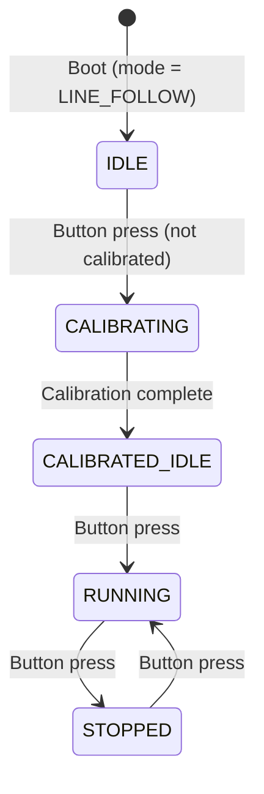

# Design Document: Line Follower Button Control

## Overview

This design reworks the sumo bot firmware (`sumo_bot.ino`) to operate exclusively in line follower mode, controlled by a single push button on D10. The changes include:

1. Commenting out the boot-time mode selection (`selectMode()`) and defaulting to `LINE_FOLLOW`
2. Adding a push button on D10 (INPUT_PULLUP) with a state machine governing calibration and start/stop
3. Updating TB6612FNG motor driver pin assignments to the new wiring
4. Splitting the single 6-sensor QTR array into two separate `QTRSensors` objects (Left and Right boards) with individual emitter pins
5. Making calibration duration a configurable constant (default 15 seconds)
6. Adding serial feedback at every state transition

All changes are confined to `sumo_bot.ino`. No new files or libraries are introduced beyond the existing `QTRSensors` dependency.

## Architecture

The firmware remains a single-file Arduino sketch. The architectural changes are:



### Control Flow Changes

**setup():**
1. Initialize motor driver pins (new mapping)
2. Initialize button pin D10 as INPUT_PULLUP
3. Initialize two QTRSensors objects (left + right) with separate emitter pins
4. Print boot message with mode = LINE_FOLLOW
5. Set button state to IDLE
6. *(selectMode() call and calibrateQTR() call are commented out)*

**loop():**
1. Read button with debounce (200ms minimum interval)
2. Execute button state machine transitions
3. If state == CALIBRATING: run calibration sweep for `CALIBRATION_DURATION_MS`
4. If state == RUNNING: read combined sensor array, compute PID, drive motors
5. All other states: motors stopped

### Key Design Decisions

- **Two QTRSensors objects instead of one**: The Pololu QTRSensors library supports one emitter pin per object. Since the two QTR-MD-03RC boards have separate emitter/control pins (D12 for left, D11 for right), we must use two objects and combine their readings into a single 6-element array for PID calculation.
- **State machine in loop() rather than blocking**: The calibration and button logic use non-blocking timing (`millis()`) so the main loop remains responsive. Calibration alternates motor direction in timed intervals rather than using blocking `delay()` loops.
- **Commented-out code preserved**: The `selectMode()` function body and its call in `setup()` are commented out (not deleted) per requirements, allowing future re-enablement.

## Components and Interfaces

### 1. Pin Definitions (Updated Constants)

```cpp
// Motor driver — TB6612FNG (new wiring)
const uint8_t PWMA     = 9;   // Left motor speed (PWM)
const uint8_t AIN2     = 8;   // Left motor direction
const uint8_t AIN1     = 7;   // Left motor direction
const uint8_t STBY_PIN = 6;   // Standby
const uint8_t BIN1     = 5;   // Right motor direction
const uint8_t BIN2     = 4;   // Right motor direction
const uint8_t PWMB     = 3;   // Right motor speed (PWM)

// Line follower button
const uint8_t LF_BUTTON_PIN = 10;  // INPUT_PULLUP, active LOW

// QTR sensor pins
// Left board: A3, A4, A5 with emitter on D12
// Right board: A0, A1, A2 with emitter on D11
const uint8_t LEFT_EMITTER_PIN  = 12;
const uint8_t RIGHT_EMITTER_PIN = 11;
```

### 2. Dual QTR Sensor Objects

```cpp
QTRSensors qtrLeft;
QTRSensors qtrRight;

const uint8_t SENSORS_PER_BOARD = 3;
const uint8_t TOTAL_SENSORS     = 6;

uint8_t leftSensorPins[SENSORS_PER_BOARD]  = {A3, A4, A5};
uint8_t rightSensorPins[SENSORS_PER_BOARD] = {A0, A1, A2};

uint16_t sensorValues[TOTAL_SENSORS];  // Combined: [0..2]=left, [3..5]=right
```

**Initialization** (in `setup()`):
```cpp
qtrLeft.setTypeRC();
qtrLeft.setSensorPins(leftSensorPins, SENSORS_PER_BOARD);
qtrLeft.setEmitterPin(LEFT_EMITTER_PIN);

qtrRight.setTypeRC();
qtrRight.setSensorPins(rightSensorPins, SENSORS_PER_BOARD);
qtrRight.setEmitterPin(RIGHT_EMITTER_PIN);
```

**Combined read function**:
```cpp
// Reads both boards into the combined sensorValues[6] array
void readAllSensors() {
  uint16_t leftVals[SENSORS_PER_BOARD];
  uint16_t rightVals[SENSORS_PER_BOARD];
  qtrLeft.read(leftVals);
  qtrRight.read(rightVals);
  memcpy(&sensorValues[0], leftVals, sizeof(leftVals));
  memcpy(&sensorValues[SENSORS_PER_BOARD], rightVals, sizeof(rightVals));
}
```

**Combined calibrated read for line position**:
```cpp
// Returns line position 0–5000 using calibrated values from both boards
uint16_t readLinePosition() {
  uint16_t leftVals[SENSORS_PER_BOARD];
  uint16_t rightVals[SENSORS_PER_BOARD];
  qtrLeft.readCalibrated(leftVals);
  qtrRight.readCalibrated(rightVals);
  memcpy(&sensorValues[0], leftVals, sizeof(leftVals));
  memcpy(&sensorValues[SENSORS_PER_BOARD], rightVals, sizeof(rightVals));

  // Manual line position calculation (weighted average)
  uint32_t avg = 0;
  uint32_t sum = 0;
  for (uint8_t i = 0; i < TOTAL_SENSORS; i++) {
    uint16_t val = sensorValues[i];
    avg += (uint32_t)val * i * 1000;
    sum += val;
  }
  if (sum == 0) return 0;
  return avg / sum;
}
```

> **Note**: Since we use two separate QTRSensors objects, we cannot call `qtr.readLineBlack()` on a single object for all 6 sensors. Instead, we read calibrated values from each board separately, combine them, and compute the weighted-average line position manually. The formula replicates the Pololu library's `readLineBlack()` logic: `position = Σ(value_i × i × 1000) / Σ(value_i)`, yielding 0 (far left) to 5000 (far right).

### 3. Button State Machine

```cpp
enum ButtonState : uint8_t {
  BS_IDLE,            // Boot state, not calibrated
  BS_CALIBRATING,     // Calibration in progress
  BS_CALIBRATED_IDLE, // Calibrated, waiting for start
  BS_RUNNING,         // Line following active
  BS_STOPPED          // Line following paused (toggle)
};

ButtonState btnState = BS_IDLE;
bool isCalibrated = false;

// Debounce
const unsigned long DEBOUNCE_MS = 200;
unsigned long lastButtonPress = 0;

// Calibration timing
unsigned long calibrationStart = 0;
```

**Button read with debounce**:
```cpp
bool buttonPressed() {
  if (digitalRead(LF_BUTTON_PIN) == LOW) {
    unsigned long now = millis();
    if (now - lastButtonPress >= DEBOUNCE_MS) {
      lastButtonPress = now;
      return true;
    }
  }
  return false;
}
```

**State machine logic** (called from `loop()`):
```cpp
void handleButtonStateMachine() {
  switch (btnState) {

    case BS_IDLE:
      if (buttonPressed()) {
        if (!isCalibrated) {
          btnState = BS_CALIBRATING;
          calibrationStart = millis();
          Serial.print(F("Calibrating for "));
          Serial.print(CALIBRATION_DURATION_MS / 1000);
          Serial.println(F("s..."));
        } else {
          btnState = BS_RUNNING;
          Serial.println(F("Line following started."));
        }
      }
      break;

    case BS_CALIBRATING:
      runCalibrationSweep();
      if (millis() - calibrationStart >= CALIBRATION_DURATION_MS) {
        stopMotors();
        isCalibrated = true;
        btnState = BS_CALIBRATED_IDLE;
        Serial.println(F("Calibration complete. Press button to start."));
      }
      break;

    case BS_CALIBRATED_IDLE:
      if (buttonPressed()) {
        btnState = BS_RUNNING;
        Serial.println(F("Line following started."));
      }
      break;

    case BS_RUNNING:
      if (buttonPressed()) {
        stopMotors();
        btnState = BS_STOPPED;
        Serial.println(F("Line following stopped."));
      } else {
        runLineFollow();
      }
      break;

    case BS_STOPPED:
      if (buttonPressed()) {
        btnState = BS_RUNNING;
        Serial.println(F("Line following started."));
      }
      break;
  }
}
```

### 4. Non-Blocking Calibration Sweep

```cpp
const unsigned long CALIBRATION_DURATION_MS = 15000;  // Configurable, default 15s

void runCalibrationSweep() {
  unsigned long elapsed = millis() - calibrationStart;
  unsigned long halfDuration = CALIBRATION_DURATION_MS / 2;

  // First half: CW sweep. Second half: CCW sweep.
  if (elapsed < halfDuration) {
    setMotors(110, -110);
  } else {
    setMotors(-110, 110);
  }

  // Calibrate both sensor boards each tick
  qtrLeft.calibrate();
  qtrRight.calibrate();
}
```

### 5. Modified setup() Flow

```cpp
void setup() {
  Serial.begin(115200);
  Serial.println(F("=== Sumo Bot Booting ==="));
  Serial.println(F("Mode: LINE_FOLLOW (default)"));

  // Motor driver pins
  pinMode(AIN1, OUTPUT); pinMode(AIN2, OUTPUT); pinMode(PWMA, OUTPUT);
  pinMode(BIN1, OUTPUT); pinMode(BIN2, OUTPUT); pinMode(PWMB, OUTPUT);
  pinMode(STBY_PIN, OUTPUT);
  digitalWrite(STBY_PIN, HIGH);
  stopMotors();

  // Button
  pinMode(LF_BUTTON_PIN, INPUT_PULLUP);

  // QTR sensors (two boards)
  qtrLeft.setTypeRC();
  qtrLeft.setSensorPins(leftSensorPins, SENSORS_PER_BOARD);
  qtrLeft.setEmitterPin(LEFT_EMITTER_PIN);

  qtrRight.setTypeRC();
  qtrRight.setSensorPins(rightSensorPins, SENSORS_PER_BOARD);
  qtrRight.setEmitterPin(RIGHT_EMITTER_PIN);

  // Mode selection commented out:
  // selectMode();

  Serial.println(F("Calibration not done. Press button to calibrate."));
  // State starts as BS_IDLE
}
```

### 6. Modified loop() Flow

```cpp
void loop() {
  handleButtonStateMachine();
}
```

The loop is simplified to just the button state machine. Line following logic runs only when `btnState == BS_RUNNING`. Edge detection for sumo mode is no longer relevant since the bot defaults to line follow only.

### 7. Modified runLineFollow()

The existing PID logic is preserved but uses the new `readLinePosition()` function instead of `qtr.readLineBlack()`:

```cpp
void runLineFollow() {
  uint16_t pos   = readLinePosition();
  float    error = (float)pos - 2500.0f;
  // ... rest of PID unchanged ...
}
```

## Data Models

### Pin Assignment Map

| Function | Old Pin | New Pin | Notes |
|----------|---------|---------|-------|
| PWMA (Left speed) | D5 | D9 | PWM capable |
| AIN2 (Left dir) | D7 | D8 | Digital |
| AIN1 (Left dir) | D4 | D7 | Digital |
| STBY | D13 | D6 | Digital |
| BIN1 (Right dir) | D8 | D5 | Digital |
| BIN2 (Right dir) | D12 | D4 | Digital |
| PWMB (Right speed) | D6 | D3 | PWM capable |
| LF Button | N/A | D10 | INPUT_PULLUP, new |
| Left QTR sensors | D11,A0,A1 | A3,A4,A5 | Reordered |
| Left QTR emitter | N/A | D12 | New, separate emitter |
| Right QTR sensors | A2,A3,A4 | A0,A1,A2 | Reordered |
| Right QTR emitter | N/A | D11 | New, separate emitter |

### Button State Machine States

| State | Description | Motors | Transitions |
|-------|-------------|--------|-------------|
| BS_IDLE | Boot state, not calibrated | Off | Button → BS_CALIBRATING (if not calibrated) or BS_RUNNING (if calibrated) |
| BS_CALIBRATING | Sweeping for calibration | CW/CCW sweep | Timer expires → BS_CALIBRATED_IDLE |
| BS_CALIBRATED_IDLE | Calibrated, waiting | Off | Button → BS_RUNNING |
| BS_RUNNING | Line following active | PID-controlled | Button → BS_STOPPED |
| BS_STOPPED | Paused | Off | Button → BS_RUNNING |

### Configurable Parameters

| Parameter | Type | Default | Location |
|-----------|------|---------|----------|
| CALIBRATION_DURATION_MS | unsigned long | 15000 | Tuning parameters section |
| DEBOUNCE_MS | unsigned long | 200 | Button constants section |
| LF_BUTTON_PIN | uint8_t | 10 | Pin definitions section |

